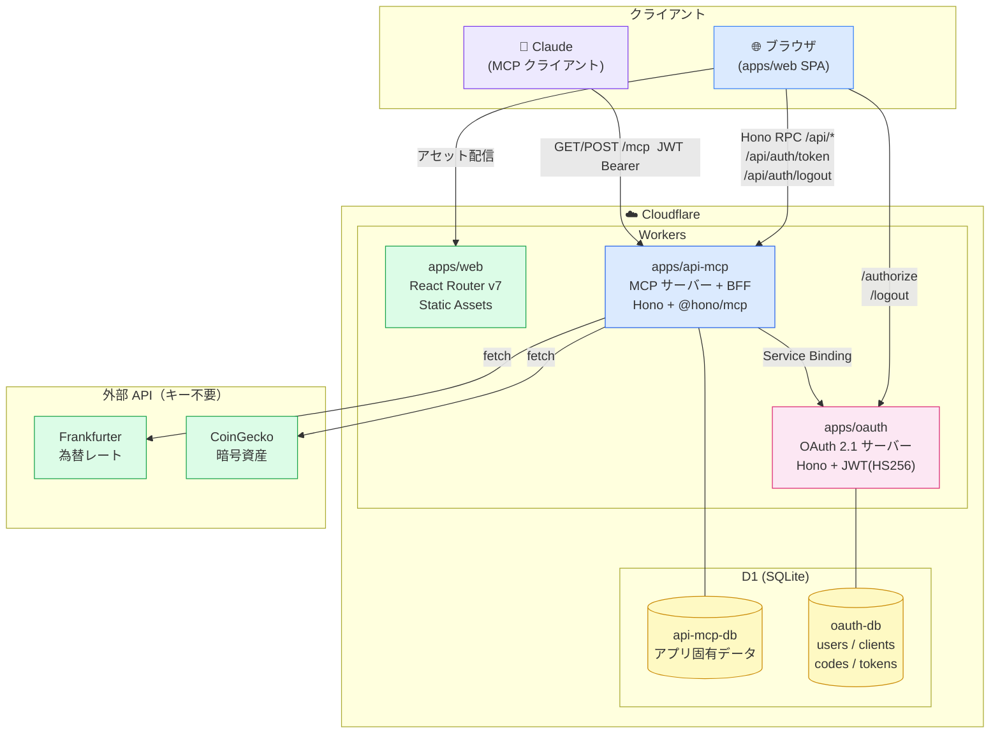

# mcp-oauth

MCPサーバー + WebAPI（`apps/api-mcp`）とOAuthサーバー（`apps/oauth`）、
Webフロントエンド（`apps/web`）のモノレポ。

ClaudeからMCPサーバーへのアクセスと、通常のWebアプリを同一のOAuth認証基盤で管理する。
OAuth 2.1 準拠（PKCE + DCR + リフレッシュトークン Rotation）。

## 構成

```
apps/
  api-mcp/  - MCPサーバー + Web API + BFF (Cloudflare Workers + Hono)
  oauth/    - OAuth 2.1 認証・認可サーバー (Cloudflare Workers + Hono)
  web/      - Webフロントエンド (React Router v7 SPA)
packages/
  database/   - Drizzle ORM + Cloudflare D1（DB_OAUTH / DB_API_MCP）
  types/      - 共通型定義 (Result<T>)
  constants/  - 共通定数（OAUTH_PATHS / API_MCP_PATHS / WEB_PATHS）
  utils/      - 共通ユーティリティ（複数アプリ横断のみ）
```

## ローカル開発セットアップ

### 1. 依存パッケージインストール

```bash
pnpm install
```

### 2. シークレット設定

`apps/oauth/.dev.vars` と `apps/api-mcp/.dev.vars` を作成する（gitignore済み）。
両ファイルに **同じ** `JWT_SECRET` を設定すること。

```bash
# JWT_SECRET を生成してコピーする
openssl rand -base64 32
```

```bash
# apps/oauth/.dev.vars
JWT_SECRET=<上で生成した値>

# apps/api-mcp/.dev.vars
JWT_SECRET=<同じ値>
```

### 3. ローカルDBのマイグレーション

```bash
# OAuthサーバーのDB（users / oauth_clients / authorization_codes / refresh_tokens）
pnpm -F @mcp-oauth/oauth db:migrate:local

# api-mcpのDB
pnpm -F @mcp-oauth/api-mcp db:migrate:local
```

> マイグレーションSQLが存在しない場合は先に生成する:
> ```bash
> pnpm -F @mcp-oauth/database db:generate:oauth
> pnpm -F @mcp-oauth/database db:generate:mcp
> ```

### 4. 初期データ投入（シード）

```bash
pnpm -F @mcp-oauth/database db:seed
# 投入される内容:
#   ユーザー: admin@example.com / password
#   OAuthクライアント: web-client
```

### 5. Web の環境変数

`apps/web/.env.local` を作成する（gitignore済み）:

```bash
VITE_API_BASE_URL=http://localhost:30001
VITE_OAUTH_BASE_URL=http://localhost:30002
VITE_WEB_BASE_URL=http://localhost:30000
```

### 6. 起動

```bash
pnpm dev
# web      → http://localhost:30000
# api-mcp  → http://localhost:30001
# oauth    → http://localhost:30002
```

ブラウザで `http://localhost:30000` を開き、`admin@example.com` / `password` でログインできれば完了。

## コマンド

```bash
# 開発
pnpm dev                                          # 全アプリ起動
pnpm -F @mcp-oauth/api-mcp dev                   # api-mcpのみ
pnpm -F @mcp-oauth/oauth dev                     # OAuthサーバーのみ
pnpm -F @mcp-oauth/web dev                       # Webフロントエンドのみ

# ビルド・品質チェック
pnpm build && pnpm format && pnpm lint:check

# DBマイグレーション（SQLファイル生成）
pnpm -F @mcp-oauth/database db:generate:oauth
pnpm -F @mcp-oauth/database db:generate:mcp

# DBマイグレーション適用
pnpm -F @mcp-oauth/oauth db:migrate:local        # ローカルD1
pnpm -F @mcp-oauth/oauth db:migrate:remote       # Cloudflare D1（本番）
pnpm -F @mcp-oauth/api-mcp db:migrate:local
pnpm -F @mcp-oauth/api-mcp db:migrate:remote

# シード投入
pnpm -F @mcp-oauth/database db:seed

# デプロイ
pnpm -F @mcp-oauth/oauth deploy
pnpm -F @mcp-oauth/api-mcp deploy
pnpm -F @mcp-oauth/web deploy
```

## インフラ構成



---

## エンドポイント一覧

### OAuthサーバー（`apps/oauth`）

| メソッド | パス | 説明 |
|---------|------|------|
| GET | `/.well-known/oauth-authorization-server` | Discovery メタデータ |
| POST | `/register` | DCR（Claude が初接続時に自動実行） |
| GET | `/authorize` | ログイン画面 or 同意画面（HTML） |
| POST | `/authorize/login` | ログイン処理・OAuthセッション Cookie 発行 |
| POST | `/authorize/consent` | 同意処理・認可コード発行 |
| POST | `/token` | 認可コード→トークン交換 / リフレッシュ |
| GET | `/logout` | OAuthセッション Cookie 削除・リダイレクト |

### api-mcpサーバー（`apps/api-mcp`）

| メソッド | パス | 認証 | 説明 |
|---------|------|------|------|
| GET | `/.well-known/oauth-protected-resource` | 不要 | Discovery メタデータ |
| GET/POST | `/mcp` | JWT必須 | MCPエンドポイント（Streamable HTTP） |
| POST | `/api/auth/token` | 不要 | 認可コード→トークン交換 BFF |
| POST | `/api/auth/refresh` | Cookie | アクセストークン更新 BFF |
| POST | `/api/auth/logout` | Cookie | ログアウト BFF |
| GET | `/api/fx/rate` | JWT必須 | 為替レート（USD/JPY等） |
| GET | `/api/fx/convert` | JWT必須 | 通貨換算 |
| GET | `/api/fx/history` | JWT必須 | 為替履歴 |
| GET | `/api/crypto/price` | JWT必須 | 暗号資産価格（BTC等） |
| GET | `/api/crypto/market` | JWT必須 | 市場データ（時価総額・変動率） |
| GET | `/api/crypto/history` | JWT必須 | 暗号資産履歴 |

### MCP プリミティブ

| 種別 | 名前 | 説明 |
|------|------|------|
| Tool | `get_fx_rate` | 2通貨間の最新為替レート |
| Tool | `convert_currency` | 金額の通貨換算 |
| Tool | `get_fx_history` | 期間指定で為替推移を取得 |
| Tool | `get_crypto_price` | 暗号資産の現在価格 |
| Tool | `get_crypto_market` | 時価総額・24h変動率など市場データ |
| Tool | `get_crypto_history` | OHLCチャートデータ |
| Prompt | `daily_market_brief` | 主要通貨・暗号資産の今日の概況をまとめる |
| Prompt | `crypto_deep_dive` | 1銘柄を多角的に分析 |

### Web画面（`apps/web`）

| パス | 画面 | 認証 | 説明 |
|------|------|------|------|
| `/` | ダッシュボード | 必須 | 為替・暗号資産レート表示・ログアウト |
| `/login` | ログイン開始 | 不要 | PKCE生成 → OAuthサーバーへリダイレクト |
| `/auth/callback` | コールバック | 不要 | 認可コード受取 → トークン取得 → `/` へ |

---

## 技術スタック

- **Runtime**: Cloudflare Workers
- **Backend Framework**: Hono v4（Hono RPC で型安全なAPI通信）
- **Frontend**: React Router v7 SPA（SSR: false）+ Tailwind CSS v4
- **Database**: Cloudflare D1 (SQLite) + Drizzle ORM
- **Auth**: OAuth 2.1 + PKCE + DCR（JWT / HS256、アクセストークン5分）
- **Build**: Turborepo + pnpm workspaces
- **Lint/Format**: Biome

## ドキュメント

| ファイル | 内容 |
|---------|------|
| [docs/01-overview.md](./docs/01-overview.md) | システム概要 |
| [docs/02-oauth-flow.md](./docs/02-oauth-flow.md) | OAuthフロー（PKCE + DCR + ログアウト） |
| [docs/03-endpoints.md](./docs/03-endpoints.md) | エンドポイント一覧・SPA実装ガイド |
| [docs/04-database.md](./docs/04-database.md) | DB設計 |
| [docs/05-screens.md](./docs/05-screens.md) | 画面設計（Tailwind CSS） |
| [docs/06-jwt-tokens.md](./docs/06-jwt-tokens.md) | JWTトークン設計 |
| [docs/07-implementation-plan.md](./docs/07-implementation-plan.md) | 実装計画・チェックリスト |

`docs/learning/` — OAuth フローや仕様の学習用メモ
